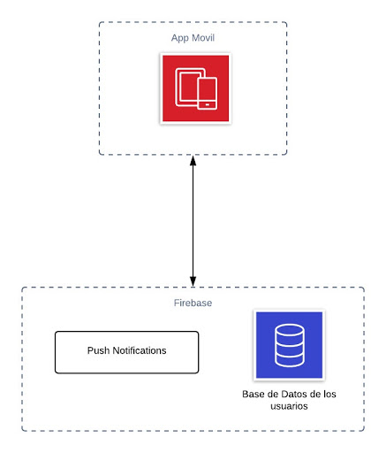
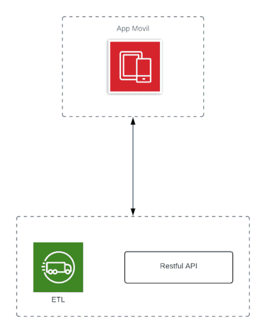
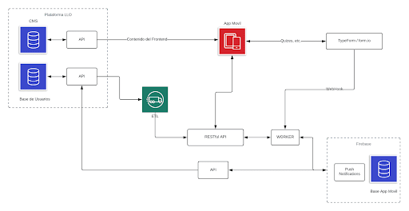

---
title: "Analisis Factores de deserción en los cursos LLO"
author: "Ana Raquel Andino"
date: "14/5/2020"
output: html_document
---

```{r setup, include=FALSE}
knitr::opts_chunk$set(echo = TRUE)
library(ggplot2)
library(dplyr)
library(caret)
```

## Introducción

Esta investigación se centra en identificar cuáles son los factores que intervienen en la deserción de los cursos de inglés que ofrece Laureate International Universities a través de la plataforma LLO. Debido a que es un problema que se ha presentado en los últimos años, se realizó una investigación para estudiar la problematica y plantear una solución.
La información de los cursos fue proporcionada por Laureate International Universities, estos datos pertenecen a los dos ultimos años 2018 y 2019. Nuestro objetivo es determinar mediante los datos proporcionados; cuáles son aquellas condiciones que generan la deserción de los cursos, con el fin de brindar a la empresa un estudio que ayude a tomar decisiones oportunas en aras de mejorar la retención de los estudiantes. Esta informe contendrá una explicación breve del análisis estadístico que se realizó dentro de la investigación, como parte de una guía complementaria que ilustra el trabajo realizado y los resultados obtenidos.

## Variables capturadas
```{r VariablesCapturadas, echo=FALSE}
# Data Inicial sin ningun tratamiento
DataInicial <- read.csv("CSV_DATASETI.csv",header = T,sep = ",",encoding = "UTF-8")
str(DataInicial)
```


Del resumen anterior es posible observar que inicialmente se contaba con `r length(names(DataInicial))` columnas a las cuales denominaremos "variables" y `r nrow(DataInicial)` registros a las cuales nos referiremos como "observaciones". En esta sección veremos un resumen rápido de las vararibles inicialmente capturadas:

```{r summaInicial, echo=FALSE}
DataInicial$Year <- as.factor(DataInicial$Year)
summary(DataInicial)
```
## Tratamiento Columnas
En esta seccion mostraremos el tratamiento inicial que se realizó a nuestro dataset con el fin de tener información más precisa y útil para nuestro análisis. Entre estos tratamientos se encuentran; la traducción y el descarte de variables, tratamiento de valores nulos y el descarte de registros u observaciones que no tomaremos encuenta. 

###  Traduccion de columnas
Para entender mejor el nombre de las culumnas se realizó la traducción de las variables al español, resultando en las siguientes variables:
```{r VariablesTraduccion, echo=FALSE}
my.names <- names(DataInicial)
df<- data.frame(nombre.columna = my.names)
write.csv(df,"ColumnasNuevas.csv",row.names = FALSE)
columnas.nuevas <- read.csv("tratamiento-nombre-columnas.csv",header = T,sep = ";",encoding = "UTF-8")

columnas.nuevas$traduccion <- as.character(columnas.nuevas$traduccion)
names(DataInicial) <- columnas.nuevas$traduccion

columnas.nuevas
```

### Valores Nulos
Uno de los tratamientos que se realizó a las variables, es la detección y transformación de aquellas observaciones que presentaban valores nulos. Al analizar nuestro dataset se encontraron valores nulos y también se detectaron valores vacios a los cuales nos referiremos como valores NA respectivamente.

```{r resumenTratamientoNulos, echo=FALSE}
DataInicial <- DataInicial[!(DataInicial$año==2020),]
na.summay <- c()
for (name in names(DataInicial)) { ##For each
  s <- as.data.frame(prop.table(table(DataInicial[,name] == "#N/A")))
  d <- as.data.frame(prop.table(table(DataInicial[,name] == "")))
  
  extracionVectorNa <- s %>% filter(Var1 == T) %>% select (Freq)
  extracionVectorVa <- d %>% filter(Var1 == T) %>% select (Freq)

  DFTemporal <- data.frame(
    column.name=c(name),
    columNa.percentage = ifelse(length(extracionVectorNa$Freq) == 0, 0, extracionVectorNa$Freq[1]),
    columVacio.percentage = ifelse(length(extracionVectorVa$Freq) == 0, 0, extracionVectorVa$Freq[1])
  )
  
  na.summay <- rbind(na.summay,DFTemporal)
}

na.summay %>% arrange(-columNa.percentage)
```
Como se puede observar solamente la variable *notaFinal* presentó valores nulos y vacíos. Por lo cual se decidió verificar la variable *estado* para las observaciones que presentan estos valores con el fin de realizar un tratamiento asertivo, ya que el estado en el que se encuentren nos puede ayudar a dar una aproximación de cómo tratarlos. Para verificar tendremos los siguientes análisis:

Frecuencia de valores nulos y vacíos por estado:

```{r frecuenciaNulos, echo=FALSE}
dfEstadoNA<- as.data.frame( table(DataInicial %>% filter(notaFinal=="#N/A") %>% select(estado)))  
dfEstadoVa<- as.data.frame( table(DataInicial %>% filter(notaFinal=="") %>% select(estado)))

  DFEstadoNulos <- data.frame(
      estado = dfEstadoNA$Var1,
     nulos.Freq = dfEstadoNA$Freq,
     vacios.Freq = dfEstadoVa$Freq
  )
  DFEstadoNulos <- DFEstadoNulos[!DFEstadoNulos$estado=="",]
  DFEstadoNulos
```

Porcentaje de valores nulos y vacíos por estado:
```{r porcentajeNulos, echo=FALSE}
  DFEstadoNulosPer <- data.frame(
     estado = dfEstadoNA$Var1,
     nulos.Freq = (dfEstadoNA$Freq/ 4776),
     vacios.Freq = (dfEstadoVa$Freq/ 4776),
     total.Freq = (dfEstadoNA$Freq/ 4776) + (dfEstadoVa$Freq/ 4776)
  )
  DFEstadoNulosPer <- DFEstadoNulosPer[!DFEstadoNulosPer$estado=="",]
  DFEstadoNulosPer
```


En el análisis podemos observar que el porcentaje de estudiantes que se encuentran en un estado “Dropout” y que a su vez no tienen una nota asignada es de 3.6% aproximadamente, mientras que para aquellos estudiantes que se encuentran en un estado “No Show” y no tienen nota, representan un 8.9 %. Dado que sus porcentajes son bajos y el resto de  estudiantes en ambos estados que si presentan una calificación tienen asignado 0 como nota final, se decidió imputar con valor 0 en su nota final a los estudiantes con estas condiciones:

```{r imputacionNulosDropNoShow}
DFTemporalDrop<- DataInicial %>% filter( (estado=="Dropout"))
DFTemporalNoshow<- DataInicial %>% filter(estado=="No Show")

DFTemporalDrop[DFTemporalDrop$estado=="Dropout","notaFinal"] <- 0
DFTemporalNoshow[DFTemporalNoshow$estado=="No Show","notaFinal"] <- 0

```


En cuanto al 3.8 % de estudiantes que se encuentran en un estado “Pass” y no tienen nota se estableció asignarles como nota final el promedio de las notas de aquellos estudiantes que sí tienen una calificación asignada y su estado es “Pass”. 

```{r calculoPromedios, echo=FALSE,warning=FALSE}

df.Pass <- DataInicial %>% filter(estado=="Pass")
df.Pass <- df.Pass[!(df.Pass$notaFinal==""),]
df.Pass$notaFinal <- as.numeric(levels(df.Pass$notaFinal))[df.Pass$notaFinal]
meanRegistrosPro<- format(round(mean(df.Pass$notaFinal), 2), nsmall = 2)


df.fail <- DataInicial %>% filter(estado=="Fail") 
df.fail <- df.fail[!(df.fail$notaFinal==""),]
df.fail$notaFinal <- as.numeric(levels(df.fail$notaFinal))[df.fail$notaFinal]
meanRegistrosFail<- format(round(mean(df.fail$notaFinal), 2), nsmall = 2)
```

```{r asignacionPromedioPass, warning=FALSE}

DFTemporalPass<- DataInicial %>% filter(estado=="Pass")
DFTemporalPass$notaFinal <- as.numeric(levels(DFTemporalPass$notaFinal))[DFTemporalPass$notaFinal]

DFTemporalPass[is.na(DFTemporalPass$notaFinal),"notaFinal"] <- meanRegistrosPro
```


De igual forma para los estudiantes en el estado “Fail” que no tenían una nota asignada representan el 7.7% y se optó por aplicar el mismo tratamiento aplicado en el estado “Pass”, a través del promedio de las calificaciones de aquellos que sí tienen un valor en su nota final y ¨se encuentran en un estado “Fail”.
``` {r asignacionPromedioFall ,warning=FALSE}
DFTemporalFail<- DataInicial %>% filter(estado=="Fail")
DFTemporalFail$notaFinal <- as.numeric(levels(DFTemporalFail$notaFinal))[DFTemporalFail$notaFinal]

DFTemporalFail[is.na(DFTemporalFail$notaFinal),"notaFinal"] <- meanRegistrosFail

```

Con las imputaciones realizadas podemos observar que la variable no tiene valores vacíos:

```{r comprobacionNulos, echo=FALSE}
##Hacer el AIRbind
DFGeneralRows <- c()
DFGeneralRows <- rbind(DFGeneralRows,DFTemporalPass)
DFGeneralRows <- rbind(DFGeneralRows,DFTemporalFail)
DFGeneralRows <- rbind(DFGeneralRows,DFTemporalDrop)
DFGeneralRows <- rbind(DFGeneralRows,DFTemporalNoshow)

##Ejecutar For para comprobar Valores Nulos y vacios = 0
DataInicial<-DFGeneralRows

na.summay <- c()
for (name in names(DataInicial)) { ##For each
  s <- as.data.frame(prop.table(table(DataInicial[,name] == "#N/A")))
  d <- as.data.frame(prop.table(table(DataInicial[,name] == "")))
  
  extracionVectorNa <- s %>% filter(Var1 == T) %>% select (Freq)
  extracionVectorVa <- d %>% filter(Var1 == T) %>% select (Freq)

  DFTemporal <- data.frame(
    column.name=c(name),
    columNa.percentage = ifelse(length(extracionVectorNa$Freq) == 0, 0, extracionVectorNa$Freq[1]),
    columVacio.percentage = ifelse(length(extracionVectorVa$Freq) == 0, 0, extracionVectorVa$Freq[1])
  )
  
  na.summay <- rbind(na.summay,DFTemporal)
}

na.summay %>% arrange(-columNa.percentage)

```

### Descarte de variables 
Se realizó el descarte de variables que no son relevantes como nombre, clase, lenguaje, nivel, correo, año, etc. En el caso del nombre se descartó ya que es catalogada como información sensible. También se descartaron aquellas variables que se emplearon para ser representadas por nuevas variables; tal es el caso de *institucion* a través de la cual se obtuvo el ranking de las uviversidades, la variable *país* de la cual se determinó el índice de desarrollo humano, al igual que la variable *correo* la cual se utilizó para determinar el número de lanzamientos consecutivos que un estudiante ha matriculado durante el año. La *notaFinal* que fue utilizada para determinar el rendimiento del estudiante.

Posteriormente se descartaron variables que se utilizaron para generar nuevas variables como el *indiceIDH* y *ranking* que fueron empleadas para determinar el nivel de desarrollo educativo al que un estudiante pertenece. Finalmente las variables *rendimiento* y *asistencia* que se fueron utilizadas para conocer el desempeño obtenido por el estudiante durante los lanzamientos.

```{r read_csv_new_columns, echo=FALSE}
#Se lee archivo donde ya se añadieron las nuevas columnas, los demas compañeros explican esa parte
coursesData <- read.csv("courses_data_cleaned_desempeño.csv",header = T,sep = ",", encoding = "UTF-8")
```
  
```{r column_deletion}
coursesData <- coursesData[,!(names(coursesData) %in% c("correo","institucion","notaFinal","ranking","indiceIDH","mediaNotas","año","asistencia","rendimiento", "lenguaje", "clase","nivel"))]
names(coursesData)[4] <- "nivelEducativo"
names(coursesData)
```

### Descarte Registros
Uno de los análisis realizado fue a las universidades, dado que ellas se representaron a través del “ranking” al cual pertenecen estas instituciones, mientras que el país se representó por “indiceIDH”, uno de las consideraciones que se realizó fue no tomar en cuenta aquellas instituciones que no se encontraban dentro del ranking de universidades de América latina y aquellas que no pertenecían a instituciones del continente americano, de un total de 35 Universidades solamente resultaron 24 universidades:

```{r tratamientoPaisesUniversidades ,echo=FALSE}
DataPaises <- read.csv("Universidades-Paises-NivelEducativo.csv",header = T,sep = ",",encoding = "UTF-8")
DataIdhRan<-DataPaises%>% select(universidadEquivalente,ranking,pais,indiceIDH)
DataIdhRan
```
Por lo cual se eliminaron un total de 1224 observaciones en donde su institución no tenía un ranking asignado y no pertenecian a instituciones de America Latina.


## Análisis descriptivo
Con el fin de darles una mejor interpretación a las variables de nuestro dataset se analizarón en función de sus características, resumenes estadísticos y técnicas que nos ayudan a entenderlas mejor como el boxplot, histograma y QQ-plot. Como por ejemplo:

### Nivel de desarrollo educativo
La variable nivelDesarrolloEducativo se generó a partir de la intervención de las variables; *indiceIDH* y *ranking* las cuales respectivamente representan el país y la universidad a la que un estudiante pertenece. 


1. Para categorizar el nivel educativo se tomó en cuenta la media del indiceIDH y la mediana del ranking obtenida del resumen estadístico:
```{r MedianRankinMediaIDH, echo=FALSE}
#Media-promedio del IDH
mediaIdh<- mean(DataPaises$indiceIDH)
mediaIdh<- format(mediaIdh, nsmall = 2)
#Mediana del Ranking
medianaRan<- median(DataPaises$ranking)
dt<- data.frame(
    mediaIDH=mediaIdh,
    medianaRankig=medianaRan)
dt

```

2. Inicialmente la variable nivelDesarrolloEducativo se transformó en cuatro categorías o niveles;
  * Nivel Educativo Alto
  * Nivel Educativo Medio Alto
  * Nivel educativo Medio Bajo
  * Nivel educativo Bajo
En la siguiente tabla se puede visualizar el porcentaje de cada nivel con respecto al total de observaciones del dataset:

```{r tratamientoNivelEducativoIVCat, echo=FALSE,warning=FALSE}
#-----------DataFrame cuadrante IV Cat> Nivel EducativoAlto
dfIDHAlto<- DataPaises[DataPaises$indiceIDH >= mediaIdh[1] , ]
dfNivelEducativoAlto<- dfIDHAlto[dfIDHAlto$ranking <= medianaRan[1] , ]
dfNivelEducativoAlto[,"NivelEducativo"]<- "Alto"

#-----------DataFrame cuadrante II Cat> Nivel EducativoBajo
dfIDHBajo<- DataPaises[DataPaises$indiceIDH < mediaIdh[1] , ]
dfNivelEducativoBajo<- dfIDHBajo[dfIDHBajo$ranking > medianaRan[1] , ]
dfNivelEducativoBajo[,"NivelEducativo"]<- "Bajo"

#-----------DataFrame cuadrante I  Cat> Nivel EducativoMedio
dfIDHBajoM<- DataPaises[DataPaises$indiceIDH >= mediaIdh[1] , ]
dfNivelEducativoMedioII<- dfIDHBajoM[dfIDHBajoM$ranking > medianaRan[1] , ]
dfNivelEducativoMedioII[,"NivelEducativo"]<- "Medio Bajo"

#-----------DataFrame cuadrante III  Cat> Nivel EducativoMedio
dfIDHAltoM<- DataPaises[DataPaises$indiceIDH < mediaIdh[1] , ]
dfNivelEducativoMedioIV<- dfIDHAltoM[dfIDHAltoM$ranking <= medianaRan[1] , ]
dfNivelEducativoMedioIV[,"NivelEducativo"]<- "MedioAlto"


##Hacer el AIRbind de los dataframes obtenidos
DFUnionNE <- c()
DFUnionNE <- rbind(DFUnionNE,dfNivelEducativoAlto)
DFUnionNE <- rbind(DFUnionNE,dfNivelEducativoMedioII)
DFUnionNE <- rbind(DFUnionNE,dfNivelEducativoBajo)
DFUnionNE <- rbind(DFUnionNE,dfNivelEducativoMedioIV)

#***************************** Uniendo categorias al csv general****************
DataIdhRan<-DFUnionNE

## Uniendo con el CSV General de Datos
DataF <- read.csv("courses_data_cleaned_institucion.csv",header = T,sep = ",",encoding = "UTF-8")
#5.Seleccionar variables de interes
DataIdhRan<-DataIdhRan%>% select(indiceIDH,ranking,universidadEquivalente,NivelEducativo)
#6. Left Join con Data Frame General
DataF <- left_join(DataF,DataIdhRan, by=c("institucion"="universidadEquivalente"))
#7. Eliminar los registros con instituciones que no tienen ranking
DataF$institucion<- as.factor(DataF$institucion)
DataF$NivelEducativo<- as.factor(DataF$NivelEducativo) 
DataF<- DataF[!is.na(DataF$ranking),]

df_perNivelDesarrolloEducativo <- as.data.frame(prop.table(table(DataF$NivelEducativo)))

# Orden
df_perNivelDesarrolloEducativo<- df_perNivelDesarrolloEducativo %>% arrange(-Freq)
df_perNivelDesarrolloEducativo
```

3. Para llevar a cabo el análisis de distribución de la variable "nivelEducativo" presentamos el resumen estadístico conformado por:  
 * Boxplot: Utilizado para visualizar la distribución de una variable numérica e identificar valores denominados atípicos o raros.
 * Histograma: Utilizado para representar variables numéricas.  
 * QQ-Plot: Utilizado para determinar si la distribución de la varaible es normal.
 En resumen, estas técnicas nos ayudan a conocer la dispersión entre las distintas categorias de una varariable.
 
 A continuación, veremos el boxplot de las categorías de la variable *nivelEducativo*. En consecuencia, el boxplot nos indica que la variable se encuentra dispersa, y el valor máximo representado por "Medio Alto" provoca esta dispersión.

```{r boxplotNivelEducativoIVCat, echo=FALSE}
boxplot(df_perNivelDesarrolloEducativo$Freq)
```

En cuanto al histograma muestra que la información se encuentra concentrada en dos grupos, y si comparamos esta información con el resumen de frecuencia podemos observar que la categoría "Medio Alto" también hace que la información se concentre solamente en dos grupos con una disoersión significante. 
```{r HistNivelEducativoIV, echo=FALSE}
hist(df_perNivelDesarrolloEducativo$Freq)
```

El qqplot el cual nos ayuda a determinar la normalidad de la variable y visiblemente muestra que la variable no es posee una distribución normal, dado que los puntos graficados no tienden a formar una diagonal.
```{r qqplotNivelEducativoIV,echo=FALSE}
qqnorm(df_perNivelDesarrolloEducativo$Freq)
```

Tomando en cuenta los resultados anteriores, se decidió tratar el nivel con mayor frecuencia y volver a redefinir los niveles con el fin de obtener una mejor distribución entre los datos, resultando en las siguientes categorías:


```{r tratamientoNivelEducativoVCat,echo=FALSE, warning=FALSE}
#-----------DataFrame cuadrante IV Cat> Nivel EducativoAlto
dfNivelEducativoAlto[,"NivelEducativo"]<- "Muy Alto"

#-----------DataFrame cuadrante II Cat> Nivel EducativoBajo
dfNivelEducativoBajo[,"NivelEducativo"]<- "Muy Bajo"

#-----------DataFrame cuadrante I  Cat> Nivel EducativoMedio
dfNivelEducativoMedioII[,"NivelEducativo"]<- "Bajo"

#-----------DataFrame cuadrante III  Cat> Nivel EducativoMedio
dfNivelEducativoMedioIV[,"NivelEducativo"]<- "MedioAlto"


##Hacer el AIRbind 
DFGeneral <- c()
DFGeneral <- rbind(DFGeneral,dfNivelEducativoAlto)
DFGeneral <- rbind(DFGeneral,dfNivelEducativoMedioII)
DFGeneral <- rbind(DFGeneral,dfNivelEducativoBajo)


##-------------------------------------------***********tratamiento medio alto medio bajo*************--------------------------
#Tratar Medio Alto
DfMedioAlto<-dfNivelEducativoMedioIV
Datax<-DfMedioAlto[,!names(DfMedioAlto)=="NivelEducativo"]

#Media-promedio del IDH
mediaIdh<- mean(Datax$indiceIDH)
#Mediana del Ranking
medianaRan<- median(Datax$ranking)


#-----------DataFrame cuadrante IV Cat> Nivel EducativoAlto
dfIDHAltoNuevo<- Datax[Datax$indiceIDH >= mediaIdh[1] , ]
dfNivelEducativoAlto<- dfIDHAltoNuevo[dfIDHAltoNuevo$ranking <= medianaRan[1] , ]
dfNivelEducativoAlto[,"NivelEducativo"]<- "Alto"


#-----------DataFrame cuadrante II Cat> Nivel EducativoBajo
dfIDHBajoNuevo<- Datax[Datax$indiceIDH < mediaIdh[1] , ]
dfNivelEducativoBajo<- dfIDHBajoNuevo[dfIDHBajoNuevo$ranking > medianaRan[1] , ]
dfNivelEducativoBajo[,"NivelEducativo"]<- "Medio"

#-----------DataFrame cuadrante I  Cat> Nivel EducativoMedio
dfIDHBajoMNuevo<- Datax[Datax$indiceIDH >= mediaIdh[1] , ]
dfNivelEducativoMedioII<- dfIDHBajoMNuevo[dfIDHBajoMNuevo$ranking > medianaRan[1] , ]
dfNivelEducativoMedioII[,"NivelEducativo"]<- "Medio"

#-----------DataFrame cuadrante III  Cat> Nivel EducativoMedio

##A;adir al General ya creado
DFGeneral <- rbind(DFGeneral,dfNivelEducativoAlto)
DFGeneral <- rbind(DFGeneral,dfNivelEducativoMedioII)
DFGeneral <- rbind(DFGeneral,dfNivelEducativoBajo)
DataIdhRan<-DFGeneral

## Uniendo con el CSV General de Datos
DataF <- read.csv("courses_data_cleaned_institucion.csv",header = T,sep = ",",encoding = "UTF-8")

#5.Seleccionar variables de interes
DataIdhRan<-DataIdhRan%>% select(indiceIDH,ranking,universidadEquivalente,NivelEducativo)
#6. Left Join con Data Frame General
DataF <- left_join(DataF,DataIdhRan, by=c("institucion"="universidadEquivalente"))
#7. Eliminar los registros con instituciones que no tienen ranking
DataF$institucion<- as.factor(DataF$institucion)
DataF<- DataF[!is.na(DataF$ranking),]

df_perNivelDesarrolloEducativo <- as.data.frame(prop.table(table(DataF$NivelEducativo)))

# Orden
df_perNivelDesarrolloEducativo<- df_perNivelDesarrolloEducativo %>% arrange(-Freq)
df_perNivelDesarrolloEducativo
```


A partir de de la nueva categorización se creó de nuevo un boxplot, un histograma y un QQ-Plot, en donde se puede observar que no existen valores atípicos en los datos, mientras que la distribución de la variable en el QQ-Plot es más normal que en el análisis anterior ya que tiende más a una diagonal.

```{r resumenNivelEducativoVCat, echo=FALSE}
boxplot(df_perNivelDesarrolloEducativo$Freq)
hist(df_perNivelDesarrolloEducativo$Freq)
qqnorm(df_perNivelDesarrolloEducativo$Freq)

```


## Analisis Correlacional

Una de las secciones importantes dentro de un análisis de datos es el “Correlacional” en donde buscamos determinar una correlación o dependencia entre las variables. Para responder una de las preguntas de investigación: ¿Será que el índice de desarrollo humano de un país y el ranking de una universidad afecta al número de estudiantes desertores?, Analizamos a un nivel correlacional si el nivel educativo al que un estudiante pertenece afecta su condición o estado de deserción. A continuación, presentamos el resumen estadístico entre el nivelDesarrolloEducativo y el estado:

1. Porcentaje de distribucion entre las variables

```{r correlacionVariables, echo=FALSE}
Data <- read.csv("courses_data_cleaned_final.csv",header = T,sep = ",",encoding = "UTF-8")
prop.table(table(Data$nivelEducativo,Data$estado),1) 

```
2. Grafico de barras apiladas al 100%

```{r ggplotCorrelacion, echo=FALSE}
ggplot(Data)+
  aes(x=nivelEducativo,fill=factor(estado)) +
  geom_bar(position = "fill") +
  theme(axis.text.x=element_text(angle=45))
```


Visualmente podemos ver que no existe una diferencia significativa entre los niveles respecto al estado, sin embargo, para determinar si existe o no independencia entre las variables se realizó la prueba de chi cuadrado y se formularon dos hipótesis a comprobar:
1.	Hipótesis nula (H_0): Las categorías de estado y nivel de desarrollo educativo son independientes
2.	Hipótesis alternativa (H_A): Las categorías de estado y nivel de desarrollo educativo son dependientes

Tomando como regla que decidimos aceptar nuestra H_0 cuando el p-value de nuestra prueba estadística chisq.test es menor a 0.05 El resultado de la prueba de chi cuadrado fue el siguiente:


```{r chiCuadradoTEST}
chisq.test(table(Data$estado,Data$nivelEducativo))
```


El p-value obtenido es de 6.02e^-07. En Conclusión, según nuestro p-value aceptamos nuestra hipótesis nula, por lo tanto, las variables son independientes, y también lo podemos verificar apoyándonos en el gráfico de barras apiladas, donde observamos que en efecto no hay una diferencia marcada entre las columnas.


## Analisis explicativo
Esta sección es el último proceso de análisis de resultados de nuestro dataset. Para tener una idea de la importancia que tienen nuestras variables y sus distintas categorías se realizó una regresión logística, de esta forma obtener aquellas variables que tienen mayor impacto en nuestra variable de resultados.

### Variable de resultados
Como variable de respuesta o dependiente : *Estado de deserción*.
El número de estudiantes desertores dentro de nuestro dataset tienen la siguiente proporción:

```{r resumenVariableResultados, echo=FALSE}
prop.table(table(Data$estado))
```

Como se puede observar el estado que queremos analizar tiene un porcentaje menor tan solo 29% del total de nuestra población analizada, no obstante, ya que es nuestro valor de interés veremos el nivel de importancia de cada una de las variables independientes en relación a este 29% de población.

### Variables independientes
Realizamos la selección de las siguientes variables para realizar la regresión logística:
Variables independientes: lanzamiento, nivelEductativo, nivelDelCurso, desempeño.

### Regresión lineal
Una vez que tenemos definidos las variables necesarias, procederemos a realizar la regresión tomando en consideración que en la regresión aplicar, nuestra variable de resultado está en función de dos variables por lo cual nuestra predicción es de carácter binomial. Podemos ver las distintas variables ordenadas por el valor de importancia resultante de la regresión.


```{r regresionLogistica, echo=FALSE}
##seleccion de variables 
features <- c('desempeño', 
              'nivelDelCurso',
              'nivelEducativo',
              'lanzamiento',
              'estado'
            )

# Se crea un dataset con las columnas de importancia
set <- Data[, names(Data) %in% features] 
set$estado <- as.factor(set$estado)

# Regresion lineal
model <- glm(estado ~ ., data = set, family = "binomial")
# Se guardan los nombres de las nuevas variables de la regresion
importances <- varImp(model)
importances$col <- row.names(importances)
importances <- importances %>% arrange(-Overall)
importances
```

Podemos ver que la variable que aparece de manera más repetida y en niveles altos es nivelEducativo, siendo superada por desempeño con su categoría de mal desempeño, nivelDelCurso con su categoría Basic y el lanzamiento Winter. 
A continuación se analizarán cada una de las variables con respecto a los porcentajes de deserción, de esta manera lograr tener una mejor visión de los comportamientos que ocurren en cada categoría.


#### *desempeño:*
Podemos visualizar las proporciones entre los estudiantes que no desertaron contra los que sí lo hicieron, podemos ver que en la categoría más alta (excelente desempeño) no hubo porcentaje de estudiantes desertores, pero a medida que se va descendiendo en las categorías podemos ver que el porcentaje aumenta de una manera exponencial, llegando a la categoría más baja donde hay más de un 25% de estudiantes desertores, con base en estas proporciones podemos decir que el desempeño es una variable de suma importancia para el número de estudiantes desertores.

```{r graficoVarDesempe, echo=FALSE}
ggplot(set) + 
  aes(x = desempeño, fill = factor(estado)) +
  geom_bar(position = "fill") +
  scale_fill_manual(values = c("#999999", "#E69F00"))
```

#### *nivelDelCurso:*
Podemos apreciar que el mayor porcentaje de deserciones se presenta en la categoría “Basic”, llegando a tener más del 25% de estudiantes desertores, esto nos dice que donde mayor deserción se da es con los estudiantes que vienen comenzando los cursos, los otros niveles presentan niveles de deserción muy similares, a partir de esto podemos decir que el nivel del curso es una variable que afecta al número de estudiantes desertores.

```{r graficoVarNivelCurso, echo=FALSE}
ggplot(set) + 
  aes(x = nivelDelCurso, fill = factor(estado)) +
  geom_bar(position = "fill") +
  scale_fill_manual(values = c("#999999", "#E69F00"))
```

#### *lanzamiento:*
se observa que las proporciones de deserción tienen valores similares, aunque el lanzamiento Winter es el que presenta menor porcentaje de estudiantes desertores, con base en los porcentajes presentados en el gráfico podemos decir que los lanzamientos no son realmente un factor clave en la deserción.
```{r graficoVarLanza, echo=FALSE}
ggplot(set) + 
  aes(x = lanzamiento, fill = factor(estado)) +
  geom_bar(position = "fill") +
  scale_fill_manual(values = c("#999999", "#E69F00"))
```

#### *nivelEducativo:*
Podemos observar que las proporciones de deserción entre los niveles de desarrollo educativo están bastante parejos, y no hay mucha diferencia entre ellos, por lo que la variable nivelDesarrolloEducativo, no afecta el número de estudiantes desertores.
```{r graficoVarNivelEdu, echo=FALSE}
ggplot(set) + 
  aes(x = nivelEducativo, fill = factor(estado)) +
  geom_bar(position = "fill") +
  scale_fill_manual(values = c("#999999", "#E69F00"))
```

## Propuesta de solucion tecnologica

Tomando en cuenta que en la actualidad múltiples plataformas de cursos en línea decidieron implementar aplicaciones móviles para aumentar la retención de usuarios y que varias de estas aplicaciones han sido exitosas, especialmente cuando son altamente interactivas.  Se propone la creación de una aplicación móvil basada en el concepto de gamificación con el fin de aumentar el número de interacciones que el usuario tiene con los cursos, esperando que debido a ello se motive al estudiante a lograr la culminación de los cursos. Para implementar gamificación, se incluirán juegos, donde el usuario puede contestar trivias y acumular cierta cantidad de puntos hasta alcanzar reconocimientos por logros. Considerando lo anterior, se recomienda lo siguiente: 

El desarrollo de la aplicación móvil será inicialmente en Android, ya que es la plataforma de mayor demanda entre los usuarios y que permite la fácil adquisición de la aplicación por parte de los usuarios a través de Google Play Store. Se sugiere utilizar el lenguaje Kotlin ya que es moderno, permite implementar el código de manera concisa y está oficialmente reconocido por Android. Para desarrollar de manera más eficiente se aconseja el uso de Android Studio, ya que es el IDE oficial y ofrece múltiples herramientas como su propio emulador y que facilitan la edición de código.

Para poder incluir juegos de trivia se hará uso de Typeform, ya que permite crear formularios, cuestionarios y otras herramientas de uso similar. Además, permite que estos formularios se puedan visualizar dentro de la app y ofrece su propio webhook el cual envía inmediatamente el resultado a la url que se desee, que en nuestro caso será a un worker Cloud Run. El worker ayuda a manejar todos los procesos en segundo plano, dejando en la aplicación móvil solamente pequeños procesamientos para que la experiencia de usuario sea más fluida y eliminar carga  al dispositivo móvil del usuario, vemos la relación entre los componentes:


Se propone una pantalla que muestre todos los logros que se pueden obtener en el curso. Por cada logro el usuario podrá visualizar una barra de progreso que le indicará cuánto le falta para completar dicho logro. Para implementar esto, se requiere de un Restful API creada a través de NodeJS que permite crear aplicaciones network escalables para que envíe la información de los logros a la aplicación. La aplicación procesa esta información y la muestra en pantalla.Vemos la relación entre los componentes:


Para aumentar el interés y el compromiso de los usuarios se decidió implementar los recordatorios o notificaciones. Se sugiere implementar Firebase que ofrece los servicios de Notification Composer y Cloud Messaging (FCM), los cuales en conjunto permiten enviar notificaciones push sin tener que preocuparse por la implementación de código o servidores y con la ventaja de ser gratuito. Además, se pueden personalizar las notificaciones y configurar plazos de vencimientos para las tareas. Vemos la relación entre los componentes:



Para mostrar el contenido de las lecciones dentro de la app, la plataforma LLO nos ofrece un CMS, que es el gestor de contenido de los cursos que almacena la información que se muestra al usuario. Este contenido sería consumido por una API desarrollada con Cloud Functions para poder desplegar esta información en la aplicación móvil y que el estudiante tenga acceso a dicho contenido desde su celular de manera interactiva y fácil.Veamos la relación entre los componentes:


Para obtener información de mayor utilidad de los usuarios de los cursos LLO en la app, se sugiere implementar un ETL que permita transformar los datos utilizando el servicio de Dataflow y Bigquery que ofrece Google para este propósito. La plataforma de LLO brinda una base de datos que contiene información sobre todos los usuarios, en este caso los alumnos que están cursando los diferentes clases virtuales de los lenguajes brindados por Laureate. Esta base de datos será consumida a través de una API que extraerá los datos de los estudiantes y que la enviara a un ETL, donde se podrá migrar y transformar la información necesaria con el fin de vincular toda la población estudiantil de los cursos LLO y obtener datos que serán necesarios para que el contenido interactivo mostrado al estudiante coincida con el nivel correspondiente. Veamos la relación entre los componentes: 


Para obtener la información de los usuarios de la plataforma LLO en la app móvil, se necesitará una restful API y un ETL, el cual transforma la información de los usuarios y la envía a la Restful API. Finalmente, la aplicación móvil consume esta API para obtener los datos necesarios como se explicó anteriormente. Veamos la relación entre los componentes:


Para que la plataforma LLO también tenga acceso a la información que se generó en la app móvil, como los logros que ha obtenido el usuario o su progreso, se conectara la base de datos propia de la app móvil a una API intermedia. Esta se comunicará con la API de LLO para que pueda recibir la información antes mencionada. Veamos la relación entre los componentes:


Con el fin que la restful API obtenga la información de la base de datos, se conectara a un worker. Este worker está conectado a la base de datos de la app móvil, donde se almacena información sobre el resultado de los formularios de typeform, los logros que ha obtenido el usuario y su progreso. Veamos la relación entre los componentes:


En la siguiente ilustración se aprecia la arquitectura completa de la solución propuesta, donde se visualizan las distintas relaciones de los componentes que se mencionaron anteriormente. 




