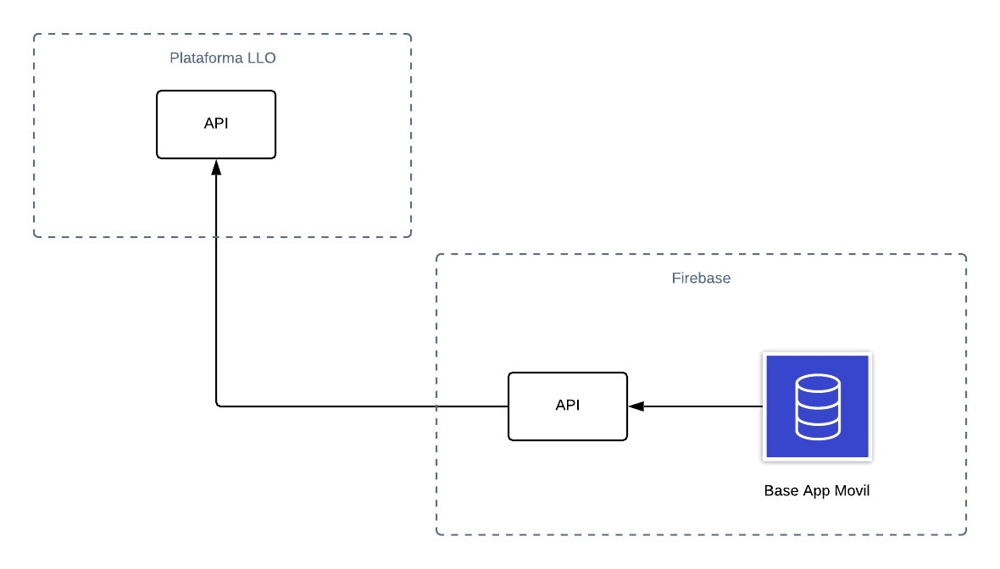

```{r setup, echo=FALSE}
knitr::opts_chunk$set(echo = TRUE)
library(dplyr)
library(ggplot2)
library(caret)
```

##Introducción

La educación en linea ha revolucionado la manera en que el aprendizaje se transmite, logrando trasasar barreras de espacio fisico, horarios, entre otras que dificultan la educación presencial. Es cada vez más comun ver como diferentes instituciones optan por ofrecer la posibilidad de aprender a través de cursos virtuales. No obstante, un factor común es la alta tasa de deserción que estos presentan. En este paper se presentan algunos de los análisis realizados, basandonos en la investigación de los factores que intervienen en la deserción de los cursos LLO de inglés de la institución Laureate Internatiotal Universities en los años 2018 y 2019, dichos cursos son impartidos al personal docente y administrativo de la institución. Partiendo de la data proporcionada por dicha institución, es importante tratar esta información para determinar los factores principales que influyen en la deserción y asi actuar de manera temprana para reducir esta problemática.

##Base de Datos proporcionada por LLO(Laureate Languages Online)


```{r leyendo_csv, include=FALSE}
getwd()
data <- read.csv("CSV_DATASET.csv", sep= ",", header = T, encoding = "UTF-8")
str(data)
```

Como se puede observar se capturaron `r nrow(data)` observaciones y `r length(names(data))` columnas.

A continuación se muestra un resumen de cada una de las variables:


```{r data_summary}
summary(data)
```

##Tratamiento de columnas


Es importante tratar los datos proporcionados para evitar trabajar con valores nulos, vacíos o información que no aporte valor a la investigación. De esta manera se asegura que los datos son de calidad y se evita el uso de información redundante. 

En primer instancia se optó por cambiar el nombre de las columnas para tener una mejor comprensión de los datos que representan.


```{r cambio_idioma_nombres, echo=FALSE}
dataNames <- names(data)
df <- data.frame(column.name = dataNames)
write.csv(df,"column_names.csv", row.names = FALSE, fileEncoding="UTF-8")
dataNames <- read.csv("column_names_treatment.csv", sep= ",", header = T, encoding = "UTF-8")
dataNames$translation <- as.character(dataNames$translation)
names(data) <- dataNames$translation
names(data)

```


##Tratamiento de registros y variables


Existen registros y variables que fueron descartadas debido a que no aportaban nada a la investigación. 

##Tratamiento de registros


Entre ellos, se eliminaron diez registros ya que corresponden a estudiantes matriculados en el primer lanzamiento del 2020, por lo tanto no tienen un estado ni una nota final asignada. Por esta razón, no resultan útiles.
```{r , registros_eliminados_2020, echo=FALSE}
data <- data[!(data$año==2020),]
```

##Tratamiento de variables


Se decidió descartar todos los valores nulos o vacíos encontrados en la variable notaFinal, debido a que los registros que presentan ésta condición tienen un estado "Dropout" o "No Show" asignado.  

##Tratamiento los valores nulos y vacíos


```{r valores_vacios_nulos, echo=FALSE}
na.summay <- c()
for (name in names(data)) {
  s <- as.data.frame(prop.table(table(data[,name] == "#N/A")))
  d <- as.data.frame(prop.table(table(data[,name] == "")))
  extraccionVectorNa <- s %>% filter(Var1 == T) %>% select (Freq)
  extraccionVectorVa <- d %>% filter(Var1 == T) %>% select (Freq)
  
  DFTemporal <- data.frame(
    Nombre_Columna=c(name),
    Porcentaje_NA = ifelse(length(extraccionVectorNa$Freq) == 0, 0, extraccionVectorNa$Freq[1]),
    Porcentaje_vacios = ifelse(length(extraccionVectorVa$Freq) == 0, 0, extraccionVectorVa$Freq[1])
  )
  na.summay <- rbind(na.summay,DFTemporal)
}

```

##Porcentaje de nulos y vacíos para notaFinal 


```{r porcentaje_nulos_vacios, echo=FALSE}
na.summay %>% arrange(-Porcentaje_NA) %>% filter(Porcentaje_NA>0) %>% filter(Porcentaje_vacios>0)
```
##Registros tratados con estado "No show" y "Dropout" con notaFinal N/A


El tratamiento realizado fue reemplazar la nota final por un cero ya que el resto de registros con este estado tienen como nota cero. 
```{r reemplazo_0, echo=FALSE}
table(data %>% filter(notaFinal=="#N/A") %>% select(estado))
data[data$notaFinal == "#N/A","notaFinal"] <- "0"
```

##Porcentaje de estados con nota final vacía


Se encontraron registros que no tenían una nota final asignada, no obstante sí presentaban un estado "Pass" o "Fail". Presentando un gran porcentaje de la data final. Fue necesario tratar estos datos 

Para tratar estos registros, se realizó el tratamiento utilizando el promedio de todas las notas finales tanto para el estado "Pass" como para "Fail" y asi asignarles una nota final.A los registros con estado "No Show" y "Dropout" se les asignó cero

##Tratamiento para estado "Pass"


```{r estado_pass_vacio, echo=FALSE}
df.Pass <- data %>% filter(estado=="Pass")
df.Pass <- df.Pass[!(df.Pass$notaFinal==""),]
df.Pass$notaFinal <- as.numeric(levels(df.Pass$notaFinal))[df.Pass$notaFinal]
meanRegistrosPro<- mean(df.Pass$notaFinal)
meanRegistrosPro<- format(round(meanRegistrosPro, 2), nsmall = 2)
DFTemporalPass<- data %>% filter(estado=="Pass")
DFTemporalPass$notaFinal <- as.numeric(levels(DFTemporalPass$notaFinal))[DFTemporalPass$notaFinal]
DFTemporalPass[is.na(DFTemporalPass$notaFinal),"notaFinal"] <- meanRegistrosPro
table(DFTemporalPass[DFTemporalPass$notaFinal==meanRegistrosPro,"notaFinal"])
DFGeneralRows <- c()
DFGeneralRows <- rbind(DFGeneralRows,DFTemporalPass)
```

##Tratamiento para estado "Fail"


```{r null_treatment_empty_fail, echo=FALSE}
df.fail <- data %>% filter(estado=="Fail") 
df.fail <- df.fail[!(df.fail$notaFinal==""),]
df.fail$notaFinal <- as.numeric(levels(df.fail$notaFinal))[df.fail$notaFinal]
meanRegistrosFail<- mean(df.fail$notaFinal)
meanRegistrosFail<- format(round(meanRegistrosFail, 2), nsmall = 2)
DFTemporalFail<- data %>% filter(estado=="Fail")
DFTemporalFail$notaFinal <- as.numeric(levels(DFTemporalFail$notaFinal))[DFTemporalFail$notaFinal]
DFTemporalFail[is.na(DFTemporalFail$notaFinal),"notaFinal"] <- meanRegistrosFail
table(DFTemporalFail[DFTemporalFail$notaFinal==meanRegistrosFail,"notaFinal"])
DFGeneralRows <- rbind(DFGeneralRows,DFTemporalFail)
```

##Tratamiento estados "No Show" y "Dropout"

 
```{r null_treatment_empty_dropout_no_show, echo=FALSE}
DFTemporalDrop<- data %>% filter( (estado=="Dropout"))
DFTemporalDrop[DFTemporalDrop$estado=="Dropout","notaFinal"] <- 0
DFTemporalNoshow<- data %>% filter(estado=="No Show")
DFTemporalNoshow[DFTemporalNoshow$estado=="No Show","notaFinal"] <- 0
DFGeneralRows <- rbind(DFGeneralRows,DFTemporalDrop)
DFGeneralRows <- rbind(DFGeneralRows,DFTemporalNoshow)
data<-DFGeneralRows
```

#Variables descartadas


Se descartaron diferentes columnas ya que se consideran con poco o ningun valor para la investigación. 
Entre estas variables encontramos la variable nombre y correo las cuales fueron descartadas ya que se consideran información sensible del estudiante. La variable clase no aporta ninguna utilidad al análisis.
La variable lenguaje se eliminó ya que solo se imparte el idioma de inglés y esto lo convierte en un valor igual para todos los registros.
La variable nivel provee la misma información que nivelEquivalente, siendo esta última más útil ya que proporciona la información agrupada, por ende se decidió dejar solamente ésta.
La variable institución se eliminó ya que se utilizó para generar el ranking en el que se posiciona. 
El IDH Y ranking se utilizaron para generar el nivelDesarrolloEducativo
La variable año se utilizó para generar el numero de lanzamientos consecutivos que un estudiante posee.
Finalmente,las variables notaFinal y mediaNotas se eliminaron ya que a partir de estas se generó una nueva
categorización surgiendo la variable rendimiento.

##Variables finales después de tratar la data


```{r column_treatment, echo=FALSE}
data <- read.csv("courses_data_cleaned_desempeño.csv",header = T,sep = ",", encoding = "UTF-8")
data <- data[,!(names(data) %in% c("correo","institucion","notaFinal","ranking","indiceIDH","mediaNotas","año","asistencia","rendimiento", "lenguaje", "clase","nivel"))]
names(data)[4] <- "nivelEducativo"
write.csv(data,"courses_data_cleaned_version_2", row.names = FALSE)
names(data)
```

##Análisis descriptivo


Se presenta el análisis descriptivo realizado a la variable estado.

Según el boxplot se pudo determinarque la información no presenta valores atípicos. Además, se pudo interpretar que la información presenta una distribución uniforme ya que la mediana del boxplot se encuentra ubicada muy cerca del centro.


```{r boxplot_analisis_Descriptivo, echo=FALSE}
df_per_Estado <-as.data.frame(prop.table(table(data$estado)))%>% arrange(Freq)

boxplot(df_per_Estado$Freq)

write.csv(data,"courses_data_cleaned_version_3.csv", row.names = FALSE)
```

Se puede observar que el histograma generado es simétrico.


```{r histograma_analisis_Descriptivo, echo=FALSE}
df_per_Estado <-as.data.frame(prop.table(table(data$estado)))%>% arrange(Freq)

hist(df_per_Estado$Freq)

write.csv(data,"courses_data_cleaned_version_3.csv", row.names = FALSE)
```

En el QQ-Plot se pudo observar que los valores por poco forman una diagonal, por lo tanto se puede interpretar que la información tiene una distribución muy aproximada a la normal.

```{r qqplot_analisis_Descriptivo, echo=FALSE}
df_per_Estado <-as.data.frame(prop.table(table(data$estado)))%>% arrange(Freq)

qqnorm(df_per_Estado$Freq)


write.csv(data,"courses_data_cleaned_version_3.csv", row.names = FALSE)
```

##Agrupación de "Dropout" y "No Show"
Tomando en cuenta que en la investigación solo nos interesa saber si un estudiante desertó un curso o no, se tomó la decisión de agrupar las categorías “Dropout” y “No Show ” en una nueva categoría llamada “Deserto”. Asimismo, se agruparon las categorías “Pass” y “Fail” en la categoría “No Deserto”. Se puede observar que aproximadamente el 30% de los estudiantes desertaron y un 70%
de los estudiantes completaron los cursos.

```{r analisis_descriptivo_deserto, echo=FALSE}
no_deserto <- table(data$estado)
```


##Análisis Correlacional
Nuestra variable de resultados, nombrada como estudiantes desertores, fue obtenida a partir de la variable estado, asignándole un valor de “deserto” a los estudiantes que presentaban un estado de “Dropout” o “No Show”, y un valor de “no desertó” a los que presentaban un estado de “Pass” o “Fail”.

Se correlacionaron las variables estado y lanzamiento para saber cual lanzamiento del año tiene mayor numero de deserciones. 

Proporciones entre la variable estado y lanzamiento


```{r analisis_correlacional_estado_lanzamiento, echo=FALSE}
data <- read.csv("courses_data_cleaned_version_3.csv", sep = ",", header = T)

prop.table(table(data$lanzamiento,data$estado),2)
prop.table(table(data$lanzamiento,data$estado),1)

```
##Gráfico de barras para lanzamiento y estado
Se construyó un gráfico de barras para estado y lanzamiento.


```{r ggplot_analisis_correlacional, echo=FALSE}
ggplot(data) +
  aes(x = lanzamiento, fill = factor(estado)) +
  geom_bar(position = "stack") +
  theme(axis.text.x = element_text(angle = 45))
```

##Gráfico de barras de apiladas, donde se puede observar la proporción de cada estado por lanzamiento.

 En él se observó que la frecuencia de deserciones no varía mucho en los lanzamientos de “Spring”, “Fall”, y “Summer”. El lanzamiento de Winter tiene una frecuencia de deserción un poco menor al resto, pero la diferencia no es mucha.
 
 
```{r grafico_barras_Apiladas_Correlacional, echo=FALSE}

ggplot(data) +
  aes(x = lanzamiento, fill = factor(estado)) +
  geom_bar(position = "fill") +
  theme(axis.text.x = element_text(angle = 45))

```
 
##Prueba Chi cuadrado


 Para determinar si las dos variables eran independientes o no, se realizó la prueba de chi cuadrado
 
 
```{r chisquare_analisis_correlacional, echo=FALSE}

chisq.test(table(data$lanzamiento, data$estado))

summary(data)
```
 
##Hipotesis

 
Se formularon dos hipótesis respecto a las dos variables categóricas lanzamiento y estado
 
1. Hipótesis Nula: Las categorías de estado y lanzamiento son
independientes
2. Hipótesis Alternativa: Las categorías de estado y lanzamiento son
dependientes.

Como regla aceptamos la hipótesis nula cuando el p-value de la prueba chi cuadrada es menor a 0.05. Después de realizar la prueba, nos dio un p-value de 2.308e-12.

##Conclusión


En conclusión, según nuestro p-value, no rechazamos nuestra hipótesis nula, por lo tanto las variables son independientes. Por una ligera diferencia, “Spring” es el lanzamiento del año que tiene la mayor frecuencia de deserciones con un 32%.
 
 
##Gráfico de lanzamiento con mayor número


```{r grafico_dropout_noshow, echo=FALSE}

##Grafico solo para mostrar que spring es el lanzamiento con el mayor numero
df_per <-as.data.frame(prop.table(table(data$estado))) %>% arrange(Freq)

#Agrupar estado en Deserto y No Deserto
df_per[df_per$Var1 %in%c("Dropout","No Show"),"deserto"] <-"Deserto"
df_per[df_per$Var1 %in%c("Pass","Fail"),"deserto"] <-"No Deserto"

#Asignar nuevamente el dataframe pero solo seleccionando Var1 y deserto
df_per <- df_per %>% select(Var1,deserto)

#Unir las categorias a coursesData con un left join donde estado sea igual a Var1
data <- left_join(data,df_per,by=c("estado"="Var1"))
names(data)
ggplot(data) +
  aes(x = lanzamiento, fill = factor(deserto)) +
  geom_bar(position = "fill") +
  theme(axis.text.x = element_text(angle = 45))

names(data)

prop.table(table(data$lanzamiento,data$deserto),1)
```


##Análisis explicativo


Para tener una idea de la importancia que tienen nuestras variables y sus distintas categorías se realizó una regresión logística, de esta manera se pudo obtener aquellas variables que tienen mayor impacto en nuestra variable de resultado.
```{r analisis_explicativo, echo=FALSE}
data <- read.csv('courses_data_cleaned_version_3.csv')

data$estudiante_desertor <- "0"

data[ data$estado == "Dropout", "estudiante_desertor" ] <- 1
data[ data$estado == "No Show", "estudiante_desertor" ] <- 1

prop.table(table(data$estudiante_desertor))

features <- c('desempeño', 
              'nivelDelCurso', 
              'lanzamiento',
              'nivelEducativo',
              'estudiante_desertor'
            )

```

Variables resultantes con sus valores


```{r analisis_explicativo_estudiantes, echo=FALSE}
set <- data[, names(data) %in% features] 
set$estudiante_desertor <- as.factor(set$estudiante_desertor)
str(set)
```


Se le asignan nombre a las nuevas variables ordenadas por el valor resultante de la
regresión.


```{r analisis_explicativo_overall, echo=FALSE}
model <- glm(estudiante_desertor ~ ., data = set, family = "binomial")

importances <- varImp(model)
importances$col <- row.names(importances)
importances <- importances %>% arrange(-Overall)
importances
```


##Variable desempeño


Se muestra el gráfico del desempeño, podemos visualizar las proporciones entre los estudiantes que no desertaron contra los que sí lo hicieron, podemos ver que en la categoría más alta (excelente desempeño) no hubo porcentaje de estudiantes desertores, pero a medida que se va descendiendo en las categorías podemos ver que el porcentaje aumenta de una manera exponencial, llegando a la categoría más baja donde hay más de un 25% de estudiantes desertores, con base en estas proporciones podemos decir que el desempeño es una variable de suma importancia para el número de estudiantes desertores.

```{r analisis_explicativo_desempeño, echo=FALSE}
# DESEMPEÑO
ggplot(set) + 
  aes(x = desempeño, fill = factor(estudiante_desertor)) +
  geom_bar(position = "fill") +
  scale_fill_manual(values = c("#999999", "#E69F00"))
```

##Variable nivelDelCurso


Podemos apreciar que el mayor porcentaje de deserciones se presenta en la categoría “Basic”, llegando a tener más del 25% de estudiantes desertores, esto nos dice que donde mayor deserción se da es con los estudiantes que vienen comenzando los cursos, los otros niveles presentan niveles de deserción muy similares, a partir de esto podemos decir que el nivel del curso es una variable que afecta al número de estudiantes desertores.
```{r analisis_explicativo_nivelCurso, echo=FALSE}
# NIVEL DEL CURSO
ggplot(set) + 
  aes(x = nivelDelCurso, fill = factor(estudiante_desertor)) +
  geom_bar(position = "fill") +
  scale_fill_manual(values = c("#999999", "#E69F00"))
```

##Variable Lanzamiento


Se observa que las proporciones de deserción tienen valores similares, aunque el lanzamiento "Winter" es el que presenta menor porcentaje de estudiantes desertores, con base en los porcentajes presentados en el gráfico podemos decir que los lanzamientos no son realmente un factor clave en la deserción.
```{r analisis_explicativo_lanzamiento, echo=FALSE}
# LANZAMIENTO
ggplot(set) + 
  aes(x = lanzamiento, fill = factor(estudiante_desertor)) +
  geom_bar(position = "fill") +
  scale_fill_manual(values = c("#999999", "#E69F00"))
```

##Variable nivel educativo 


Podemos observar que las proporciones de deserción entre los niveles de desarrollo educativo están bastante parejos, y no hay mucha diferencia entre ellos, por lo que la variable nivelDesarrolloEducativo, no afecta el número de estudiantes desertores.
```{r analisis_explicativo_nivelEducativo, echo=FALSE}
# NIVEL EDUCATIVO
ggplot(set) + 
  aes(x = nivelEducativo, fill = factor(estudiante_desertor)) +
  geom_bar(position = "fill") +
  scale_fill_manual(values = c("#999999", "#E69F00"))
```

##Propuesta solución tecnológica


Tomando en cuenta que en la actualidad múltiples plataformas de cursos en línea decidieron implementar aplicaciones móviles para aumentar la retención de usuarios y que varias de estas aplicaciones han sido exitosas, especialmente cuando son altamente interactivas.  Se propone la creación de una aplicación móvil basada en el concepto de gamificación con el fin de aumentar el número de interacciones que el usuario tiene con los cursos, esperando que debido a ello se motive al estudiante a lograr la culminación de los cursos. Para implementar gamificación, se incluirán juegos, donde el usuario puede contestar trivias y acumular cierta cantidad de puntos hasta alcanzar reconocimientos por logros. Considerando lo anterior, se recomienda lo siguiente: 

El desarrollo de la aplicación móvil será inicialmente en Android, ya que es la plataforma de mayor demanda entre los usuarios y que permite la fácil adquisición de la aplicación por parte de los usuarios a través de Google Play Store. Se sugiere utilizar el lenguaje Kotlin ya que es moderno, permite implementar el código de manera concisa y está oficialmente reconocido por Android. Para desarrollar de manera más eficiente se aconseja el uso de Android Studio, ya que es el IDE oficial y ofrece múltiples herramientas como su propio emulador y que facilitan la edición de código.
Para poder incluir juegos de trivia se hará uso de Typeform, ya que permite crear formularios, cuestionarios y otras herramientas de uso similar. Además, permite que estos formularios se puedan visualizar dentro de la app y ofrece su propio webhook el cual envía inmediatamente el resultado a la url que se desee, que en nuestro caso será a un worker Cloud Run. El worker ayuda a manejar todos los procesos en segundo plano, dejando en la aplicación móvil solamente pequeños procesamientos para que la experiencia de usuario sea más fluida y eliminar carga  al dispositivo móvil del usuario. 


Se propone una pantalla que muestre todos los logros que se pueden obtener en el curso. Por cada logro el usuario podrá visualizar una barra de progreso que le indicará cuánto le falta para completar dicho logro. Para implementar esto, se requiere de un Restful API creada a través de NodeJS que permite crear aplicaciones network escalables para que envíe la información de los logros a la aplicación. La aplicación procesa esta información y la muestra en pantalla 


Para aumentar el interés y el compromiso de los usuarios se decidió implementar los recordatorios o notificaciones. Se sugiere implementar Firebase que ofrece los servicios de Notification Composer y Cloud Messaging (FCM), los cuales en conjunto permiten enviar notificaciones push sin tener que preocuparse por la implementación de código o servidores y con la ventaja de ser gratuito. Además, se pueden personalizar las notificaciones y configurar plazos de vencimientos para las tareas. 


Para mostrar el contenido de las lecciones dentro de la app, la plataforma LLO nos ofrece un CMS, que es el gestor de contenido de los cursos que almacena la información que se muestra al usuario. Este contenido sería consumido por una API desarrollada con Cloud Functions para poder desplegar esta información en la aplicación móvil y que el estudiante tenga acceso a dicho contenido desde su celular de manera interactiva y fácil.


Para obtener información de mayor utilidad de los usuarios de los cursos LLO en la app, se sugiere implementar un ETL que permita transformar los datos utilizando el servicio de Dataflow y Bigquery que ofrece Google para este propósito. La plataforma de LLO brinda una base de datos que contiene información sobre todos los usuarios, en este caso los alumnos que están cursando los diferentes clases virtuales de los lenguajes brindados por Laureate. Esta base de datos será consumida a través de una API que extraerá los datos de los estudiantes y que la enviara a un ETL, donde se podrá migrar y transformar la información necesaria con el fin de vincular toda la población estudiantil de los cursos LLO y obtener datos que serán necesarios para que el contenido interactivo mostrado al estudiante coincida con el nivel correspondiente 


Para obtener la información de los usuarios de la plataforma LLO en la app móvil, se necesitará una restful API y un ETL, el cual transforma la información de los usuarios y la envía a la Restful API. Finalmente, la aplicación móvil consume esta API para obtener los datos necesarios como se explicó anteriormente 


Para que la plataforma LLO también tenga acceso a la información que se generó en la app móvil, como los logros que ha obtenido el usuario o su progreso, se conectara la base de datos propia de la app móvil a una API intermedia. Esta se comunicará con la API de LLO para que pueda recibir la información antes mencionada


Con el fin que la restful API obtenga la información de la base de datos, se conectara a un worker. Este worker está conectado a la base de datos de la app móvil, donde se almacena información sobre el resultado de los formularios de typeform, los logros que ha obtenido el usuario y su progreso


En la siguiente ilustración se aprecia la arquitectura completa de la solución propuesta, donde se visualizan las distintas relaciones de los componentes que se mencionaron anteriormente.


